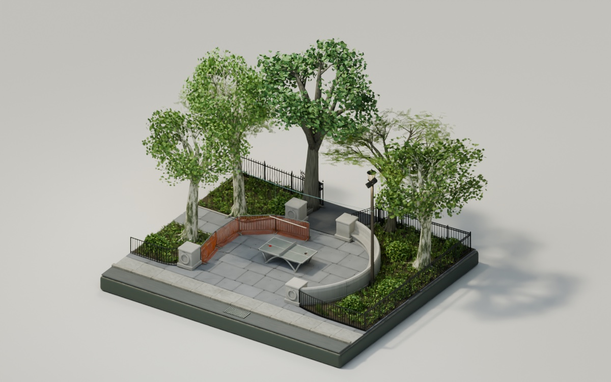

# Seward Park

An interactive 3D diorama of the table tennis area at Seward Park in New York City. The viewer follows the live sun by default, with moving shadows, dusk, nighttime park lighting, a gentle breeze, falling leaves, and an OBJ download.

Revision 9 connects all eight pointed gate caps to their uprights. It retains the removed table lettering, attached net mounts, matching stone columns, smaller STTA decal, and red and black reference paddles.



## Run locally

Use Node.js 24 and pnpm 11.19.0:

```sh
pnpm install
pnpm dev
```

Open `http://localhost:3000`.

## Controls

- Drag to orbit; scroll or pinch to zoom; right-drag to pan. Scroll zoom follows the cursor and can approach within 8 cm of the focus point.
- Double-click a detail to focus on it, then zoom closer to inspect the paddles, decal, or net hardware.
- Click the scene, then use the arrow keys or WASD to move in the direction you are looking. Left and right strafe.
- Drag while moving to look around. Q/E move down/up. Shift moves faster.
- Escape returns to orbit. Zero or the reset button returns to the overview.
- The clock button or L follows the current sun in New York. This is the default on every visit.
- The moon/sun button or N selects manual daytime or nighttime. Use the clock button to return to live sunlight.
- The download button saves the OBJ model and its material library.
- Reduced-motion preferences keep the trees and falling leaves still and apply lighting changes immediately.

## Live sunlight

Sun altitude and azimuth are calculated locally from the current UTC instant and Seward Park's coordinates (40.71483 N, 73.98915 W), using the [NOAA/Meeus solar equations](https://gml.noaa.gov/grad/solcalc/calcdetails.html). The clock label uses `America/New_York`, including daylight saving time. Scene coordinates use +X east, -Z north, and +Y up.

The sun position refreshes every 30 seconds and immediately when returning to the tab. Sky color, direct light, ambient light, and the park lamps change smoothly through dawn and dusk. The visual palette represents clear conditions. Calculations work without an external service or location permission.

## Validate

```sh
pnpm test
pnpm typecheck
pnpm lint
pnpm build
```

## Deployment

This project publishes a static website on GitHub Pages. It requires no database, backend server, or external API.

Run `pnpm build:pages` to build for `/seward-park/`. The generated `out` directory is published as the `seward-park` folder of `willieip/willieip.github.io`. The complete editable website source is in that folder's `source` directory.

The build sets `NEXT_PUBLIC_BASE_PATH` so the model, decoder, favicon, and download use the correct address. Local development uses the site root by default. GitHub Pages includes `seward-park/_next` through the repository's Jekyll configuration.

### Link previews

Open Graph and Twitter metadata are included in the exported HTML, so previews do not require JavaScript or the 3D model. The 1200 × 750 JPEG at `public/park-preview-v4.jpg` supplies the large preview, with `public/apple-touch-icon.png` as the Apple icon fallback. Keep old preview images available when publishing a new version.

Share the normal URL: `https://willieip.me/seward-park`. The canonical URL, Open Graph URL, and Twitter URL all identify that address. GitHub Pages serves its directory through a standard HTTPS redirect. No query parameters or separate preview page are required.

## Assets

- `public/park.glb` contains the compressed scene used by the viewer.
- `public/draco/` contains the local geometry decoder.
- `public/downloads/seward-park-obj.zip` contains the downloadable OBJ model and MTL material library.
- The Three.js scene, camera movement, and wind animation are in `app/`.
